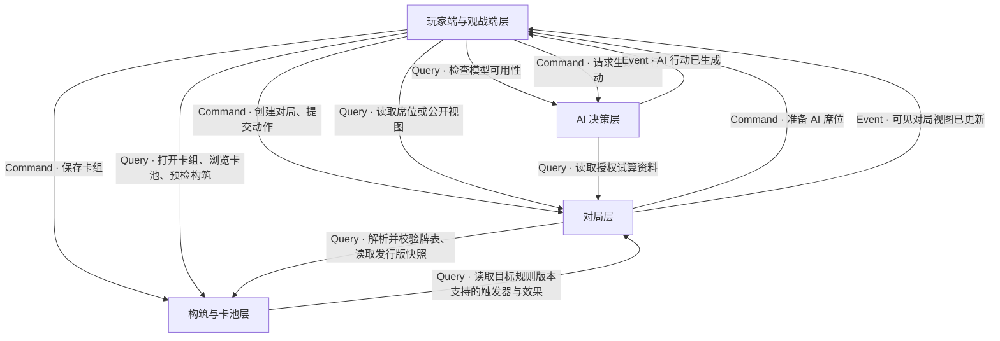
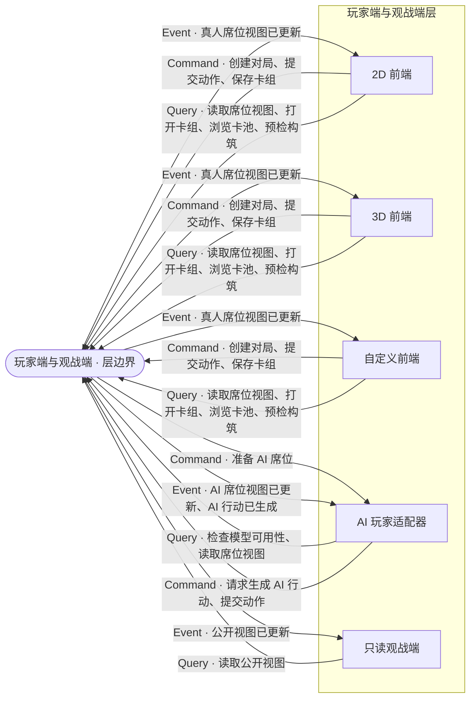
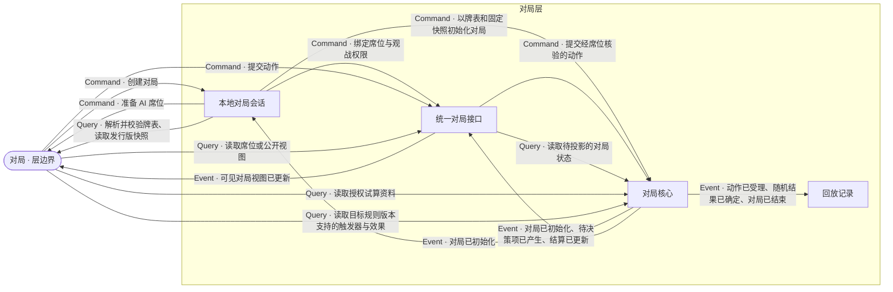
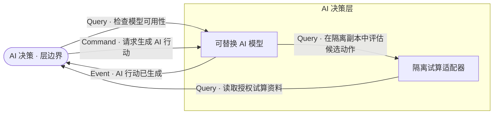
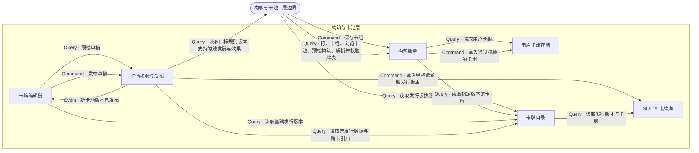

# 四层架构与边界

层级职责及权威状态以[项目章程](../../../.specify/memory/constitution.md)为准。下面的标签描述业务交互。命令受理或拒绝、查询结果沿原交互返回。

## 层级总图

```mermaid
flowchart TB
    Clients["玩家端与观战端层"]
    Match["对局层"]
    AI["AI 决策层"]
    Data["构筑与卡池层"]
    Clients -->|"Command · 创建对局、提交动作"| Match
    Clients -->|"Query · 读取席位或公开视图"| Match
    Match -->|"Command · 准备 AI 席位"| Clients
    Match -->|"Event · 可见对局视图已更新"| Clients
    Clients -->|"Query · 检查模型可用性"| AI
    Clients -->|"Command · 请求生成 AI 行动"| AI
    AI -->|"Event · AI 行动已生成"| Clients
    AI -->|"Query · 读取授权试算资料"| Match
    Clients -->|"Command · 保存卡组"| Data
    Clients -->|"Query · 打开卡组、浏览卡池、预检构筑"| Data
    Match -->|"Query · 解析并校验牌表、读取发行版快照"| Data
    Data -->|"Query · 读取目标规则版本支持的触发器与效果"| Match
```

## 玩家端与观战端层

```mermaid
flowchart LR
    B(["玩家端与观战端 · 层边界"])
    subgraph Clients["玩家端与观战端层"]
        UI2D["2D 前端"]
        UI3D["3D 前端"]
        Custom["自定义前端"]
        PlayerAI["AI 玩家适配器"]
        Spectator["只读观战端"]
    end
    UI2D & UI3D & Custom -->|"Command · 创建对局、提交动作、保存卡组"| B
    UI2D & UI3D & Custom -->|"Query · 读取席位视图、打开卡组、浏览卡池、预检构筑"| B
    B -->|"Event · 真人席位视图已更新"| UI2D & UI3D & Custom
    B -->|"Command · 准备 AI 席位"| PlayerAI
    PlayerAI -->|"Query · 检查模型可用性、读取席位视图"| B
    PlayerAI -->|"Command · 请求生成 AI 行动、提交动作"| B
    B -->|"Event · AI 席位视图已更新、AI 行动已生成"| PlayerAI
    Spectator -->|"Query · 读取公开视图"| B
    B -->|"Event · 公开视图已更新"| Spectator
```

## 对局层

```mermaid
flowchart LR
    B(["对局 · 层边界"])
    subgraph Match["对局层"]
        Session["本地对局会话"]
        Interface["统一对局接口"]
        Core["对局核心"]
        Replay["回放记录"]
    end
    B -->|"Command · 创建对局"| Session
    Session -->|"Command · 准备 AI 席位"| B
    Session -->|"Query · 解析并校验牌表、读取发行版快照"| B
    Session -->|"Command · 绑定席位与观战权限"| Interface
    Session -->|"Command · 以牌表和固定快照初始化对局"| Core
    Core -->|"Event · 对局已初始化"| Session
    B -->|"Command · 提交动作"| Interface
    B -->|"Query · 读取席位或公开视图"| Interface
    Interface -->|"Command · 提交经席位核验的动作"| Core
    Interface -->|"Query · 读取待投影的对局状态"| Core
    Core -->|"Event · 对局已初始化、待决策项已产生、结算已更新"| Interface
    Interface -->|"Event · 可见对局视图已更新"| B
    B -->|"Query · 读取授权试算资料"| Core
    B -->|"Query · 读取目标规则版本支持的触发器与效果"| Core
    Core -->|"Event · 动作已受理、随机结果已确定、对局已结束"| Replay
```

## AI 决策层

```mermaid
flowchart LR
    B(["AI 决策 · 层边界"])
    subgraph AI["AI 决策层"]
        Model["可替换 AI 模型"]
        Simulation["隔离试算适配器"]
    end
    B -->|"Query · 检查模型可用性"| Model
    B -->|"Command · 请求生成 AI 行动"| Model
    Model -->|"Query · 在隔离副本中评估候选动作"| Simulation
    Simulation -->|"Query · 读取授权试算资料"| B
    Model -->|"Event · AI 行动已生成"| B
```

## 构筑与卡池层

```mermaid
flowchart LR
    B(["构筑与卡池 · 层边界"])
    subgraph Data["构筑与卡池层"]
        Deck["构筑服务"]
        Store["用户卡组存储"]
        Editor["卡牌编辑器"]
        Release["卡池校验与发布"]
        Catalog["卡牌目录"]
        SQLite["SQLite 卡牌库"]
    end
    B -->|"Command · 保存卡组"| Deck
    B -->|"Query · 打开卡组、浏览卡池、预检构筑、解析并校验牌表"| Deck
    B -->|"Query · 读取发行版快照"| Catalog
    Deck -->|"Query · 读取用户卡组"| Store
    Deck -->|"Command · 写入通过校验的卡组"| Store
    Deck -->|"Query · 读取指定版本的卡牌"| Catalog
    Editor -->|"Query · 读取基础发行版本"| Catalog
    Editor -->|"Query · 预检草稿"| Release
    Editor -->|"Command · 发布草稿"| Release
    Release -->|"Query · 读取已发行数据与跨卡引用"| Catalog
    Release -->|"Query · 读取目标规则版本支持的触发器与效果"| B
    Release -->|"Command · 写入经校验的新发行版本"| SQLite
    Release -->|"Event · 新卡池版本已发布"| Editor
    Catalog -->|"Query · 读取发行版本与卡牌"| SQLite
```
